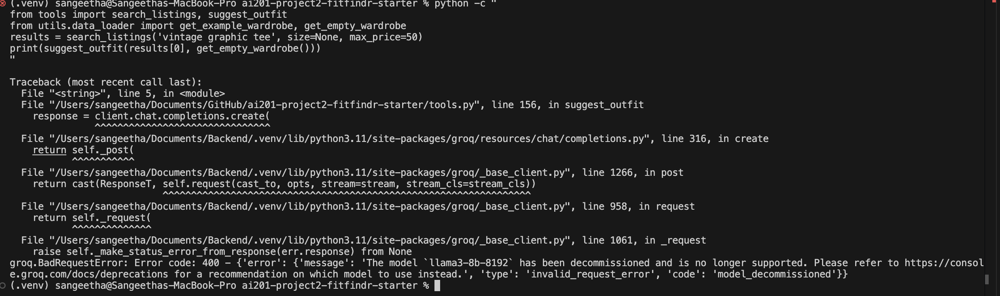

# FitFindr — Starter Kit

This starter kit contains everything you need to begin Project 2.

## What's Included

```
ai201-project2-fitfindr-starter/
├── data/
│   ├── listings.json          # 40 mock secondhand listings
│   └── wardrobe_schema.json   # Wardrobe format + example wardrobe
├── images/
├── tests/
├── utils/
│   └── data_loader.py         # Helper functions for loading the data
├── planning.md                # Your planning template — fill this out first
├── requirements.txt           # Python dependencies
├── tools.py 
└──
```

## Setup

```bash
pip install -r requirements.txt
```

Set your Groq API key in a `.env` file (get a free key at [console.groq.com](https://console.groq.com)):
```
GROQ_API_KEY=your_key_here
```

## The Mock Listings Dataset

`data/listings.json` contains 40 mock secondhand listings across categories (tops, bottoms, outerwear, shoes, accessories) and styles (vintage, y2k, grunge, cottagecore, streetwear, and more).

Each listing has: `id`, `title`, `description`, `category`, `style_tags`, `size`, `condition`, `price`, `colors`, `brand`, and `platform`.

Load it with:
```python
from utils.data_loader import load_listings
listings = load_listings()
```

## The Wardrobe Schema

`data/wardrobe_schema.json` defines the format your agent uses to represent a user's existing wardrobe. It includes:

- `schema`: field definitions for a wardrobe item
- `example_wardrobe`: a sample wardrobe with 10 items you can use for testing
- `empty_wardrobe`: a starting template for a new user

Load an example wardrobe with:
```python
from utils.data_loader import get_example_wardrobe
wardrobe = get_example_wardrobe()
```

## Where to Start

1. **Read `planning.md` and fill it out before writing any code.**
2. Verify the data loads correctly by running `python utils/data_loader.py`.
3. Build and test each tool individually before connecting them through your planning loop.

Your implementation files go in this same directory. There's no required file structure for your agent code — organize it however makes sense for your design.


## AI Implementation

1. Tool inventory: 
<!--name, inputs (parameter names and types, e.g. description (str)), outputs, and purpose of each tool (the documented inputs and return values must match your actual function signatures in the code)
How the planning loop works (describe the conditional logic, not just "it decides what to do")-->

- **`search_listings(description: str, size: str | None, max_price: float | None) → list[dict]`**
  Searches the mock listings dataset by scoring each item on keyword overlap with `description`, then filters by size (case-insensitive substring) and price ceiling. Returns up to 3 matching listing dicts sorted by relevance score, or an empty list if nothing matches.

- **`suggest_outfit(new_item: dict, wardrobe: dict) → str`**
  Given a listing dict and a wardrobe dict (with an `items` key), calls the Groq LLM to suggest outfit combinations. If the wardrobe is empty, it asks for general styling ideas instead of specific pairings. Returns a plain string.

- **`create_fit_card(outfit: str, new_item: dict) → str`**
  Given an outfit suggestion string and a listing dict, calls the Groq LLM at temperature 1.0 to generate a casual 2–4 sentence Instagram-style caption mentioning the item name, price, and platform. Returns a plain string.

**Planning loop:** `run_agent()` runs the tools in a fixed sequence with one conditional branch. It first parses the query with regex to extract size, max price, and a cleaned description. It calls `search_listings()` — if the result is empty, it sets `session["error"]` and returns immediately without calling the remaining tools. Otherwise it picks `results[0]` as the selected item, passes it to `suggest_outfit()`, then passes that output to `create_fit_card()`. The loop is done when all three tool outputs are stored in the session dict.

2. State management approach: 
<!--what is stored, when, and how it's passed between tools -->

All intermediate results are stored in a single `session` dict initialized by `_new_session()` at the start of each `run_agent()` call. The fields updated in order are: `session["parsed"]` (description, size, max_price from the query), `session["search_results"]` (list from `search_listings`), `session["selected_item"]` (top result), `session["outfit_suggestion"]` (string from `suggest_outfit`), and `session["fit_card"]` (string from `create_fit_card`). Each tool receives exactly the fields it needs from the session — no tool reads the session directly, values are passed as explicit arguments. `session["error"]` is set only on early exit and is `None` on success.

3. Error handling strategy for each tool:
<!-- , with at least one concrete example from your testing -->

- **`search_listings`**: If no listings pass the filters or score above 0, it prints `"I am sorry, your style requirements is beyond our reach! Please try a new search."` and returns `[]`. The planning loop catches the empty list and sets `session["error"]`, preventing downstream tools from being called with bad input. Tested with `search_listings("designer ballgown", size="XXS", max_price=5)` — correctly returned `[]` and printed the message.
- **`suggest_outfit`**: If the LLM returns an empty string, it prints and returns `"Your style seems to be so good as it is! We can't suggest an outfit at the moment, please try again later."` The empty wardrobe case is handled by switching to a general styling prompt rather than failing.
- **`create_fit_card`**: Guards against an empty or whitespace-only `outfit` string before calling the LLM — logs `"[create_fit_card] Error: outfit data is empty or incomplete."` and returns the fallback message. Also logs if the LLM itself returns nothing.



4. Spec reflection: 
<!--one way the spec helped you, one way implementation diverged from it and why -->

The spec helped most during error handling — having explicit failure messages defined in `planning.md` before writing code meant each tool's fallback was consistent and required no revision. One divergence: the planning.md spec listed `new_item` for `create_fit_card` as `(str)`, but the implementation uses a `dict` (the full listing object) so the prompt can include price and platform naturally. A plain string would have required the caller to pre-format those fields, which would have made the tool harder to use correctly.

5. AI usage section: 

<!-- at least 2 specific instances describing what you directed the AI to do and what you revised or overrode -->

- **Implementing `search_listings`**: I directed Claude to implement the function following the four TODO steps in the docstring — load listings, filter by price/size, score by keyword overlap, drop zero-score items, and sort. Claude's first version returned all scored matches. I overrode this to cap results at 3 (matching the planning spec) and to add the print statement on empty results, which Claude had omitted.

- **Implementing `run_agent`**: I directed Claude to implement the planning loop following the seven numbered steps in `agent.py` and to match the architecture diagram in `planning.md`. Claude used regex to parse the query, which I kept. I reviewed that the early-exit on empty search results correctly prevented `suggest_outfit` from being called with `None` — the logic was right but I verified it matched the conditional branch in the Mermaid diagram before accepting it.