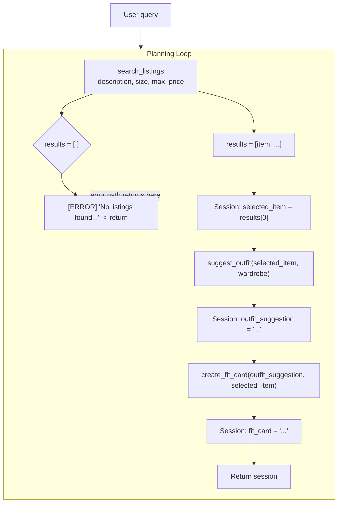

# FitFindr — planning.md

> Complete this document before writing any implementation code.
> Your spec and agent diagram are what you'll use to direct AI tools (Claude, Copilot, etc.) to generate your implementation — the more specific they are, the more useful the generated code will be.
> Your planning.md will be reviewed as part of your submission.
> Update it before starting any stretch features.

---

## Tools

List every tool your agent will use. For each tool, fill in all four fields.
You must have at least 3 tools. The three required tools are listed — add any additional tools below them.

FitFindr is an application which will search the listing for used clothes and give top matches, suggest outfits and create a fit card. 

### Tool 1: search_listings

**What it does:**
<!-- Describe what this tool does in 1–2 sentences -->
Searches the mock listings dataset and returns matching items. Must handle the case where no matches are found.

**Input parameters:**
<!-- List each parameter, its type, and what it represents -->
- `description` (str): Description of the clothing piece
- `size` (str): Size of the clothing piece
- `max_price` (float): Maximum price of the clothing piece

search_listings("vintage graphic tee", size="M", max_price=30.0)

**What it returns:**
<!-- Describe the return value — what fields does a result contain? -->
It returns 3 matching listings sorted by relevance. FitFindr picks the top result. 

**What happens if it fails or returns nothing:**
<!-- What should the agent do if no listings match? -->
If no listings match it should print out "I am sorry, your style requirements is beyond our reach! Please try a new search."
---

### Tool 2: suggest_outfit

**What it does:**
<!-- Describe what this tool does in 1–2 sentences -->
Given a specific item and the user's current wardrobe, suggests one or more complete outfit combinations. Must handle an empty or minimal wardrobe.

**Input parameters:**
<!-- List each parameter, its type, and what it represents -->
- `new_item` (dict): 
- `wardrobe` (dict): ...
suggest_outfit(new_item=<band tee>, wardrobe=<user's wardrobe>)
**What it returns:**
<!-- Describe the return value -->

It returns a statement, based on the results, for example: "Pair this with your wide-leg jeans and platform Docs for a classic 90s grunge look. Roll the sleeves once and tuck the front corner slightly for shape."

**What happens if it fails or returns nothing:**
<!-- What should the agent do if the wardrobe is empty or no outfit can be suggested? -->
If it fails it should print out a message like: "Your style seems to be so good as it is! We can't suggest an outfit at the moment, please try again later"!

---

### Tool 3: create_fit_card

**What it does:**
<!-- Describe what this tool does in 1–2 sentences -->
Generates a short, shareable description of a complete outfit — the kind of thing someone would caption an Instagram post with. Must produce something different each time for different inputs.

**Input parameters:**
<!-- List each parameter, its type, and what it represents -->
- `outfit` (str): ...
- `new_item` (str):

create_fit_card(outfit=<suggestion>, new_item=<band tee>)

**What it returns:**
<!-- Describe the return value -->
It returns something that looks like could caption an Instagram post. For example, "thrifted this faded band tee off depop for $22 and honestly it was made for my wide-legs 🖤 full look in my stories"
**What happens if it fails or returns nothing:**
<!-- What should the agent do if the outfit data is incomplete? -->
If the outfit data is incomplete or the tool fails to generate a caption, the agent should return a generic fallback message such as "Outfit details unavailable — check back later!" and log the error for debugging. The agent should not crash or leave the user with an empty response.

---

### Additional Tools (if any)

<!-- Copy the block above for any tools beyond the required three -->

---

## Planning Loop

**How does your agent decide which tool to call next?**
<!-- Describe the logic your planning loop uses. What does it look at? What conditions change its behavior? How does it know when it's done? -->
The agent runs tools in a fixed sequence: `search_listings` → `suggest_outfit` → `create_fit_card`. After calling `search_listings`, it checks whether the result list is empty — if so, it sets `session["error"]` and returns immediately, skipping the remaining two tools. This is the only conditional branch. If results exist, it always proceeds to `suggest_outfit` with the top result, then to `create_fit_card` with the outfit suggestion. The loop knows it is done when `session["fit_card"]` is populated and the session is returned.

---

## State Management

**How does information from one tool get passed to the next?**
<!-- Describe how your agent stores and accesses state within a session. What data is tracked? How is it passed between tool calls? -->
All state lives in a single `session` dict created by `_new_session()` at the start of each `run_agent()` call. After each tool runs, its output is written into the session: `search_listings` → `session["search_results"]` and `session["selected_item"]`; `suggest_outfit` → `session["outfit_suggestion"]`; `create_fit_card` → `session["fit_card"]`. Tools do not read from the session themselves — the planning loop extracts the relevant fields and passes them as explicit arguments (e.g. `suggest_outfit(session["selected_item"], session["wardrobe"])`). This keeps each tool independently testable and the data flow easy to trace.

---

## Error Handling

For each tool, describe the specific failure mode you're handling and what the agent does in response.

| Tool | Failure mode | Agent response |
|------|-------------|----------------|
| search_listings | No results match the query | "I am sorry, your style requirements is beyond our reach! Please try a new search." |
| suggest_outfit | Wardrobe is empty | "Your outfit seems to be so good as it is! We can't suggest an outfit at the moment, please try again later"! |
| create_fit_card | Outfit input is missing or incomplete | "Outfit details unavailable — check back later!" |

---

## Architecture

<!-- Draw a diagram of your agent showing how the components connect:
     User input → Planning Loop → Tools (search_listings, suggest_outfit, create_fit_card)
                                                                          ↕
                                                                   State / Session
     Show what triggers each tool, how state flows between them, and where error paths branch off.
     ASCII art, a Mermaid diagram (https://mermaid.js.org/syntax/flowchart.html), or an embedded
     sketch are all fine. You'll share this diagram with an AI tool when asking it to implement
     the planning loop and each individual tool. -->

---

## AI Tool Plan

<!-- For each part of the implementation below, describe:
     - Which AI tool you plan to use (Claude, Copilot, ChatGPT, etc.)
     - What you'll give it as input (which sections of this planning.md, your agent diagram)
     - What you expect it to produce
     - How you'll verify the output matches your spec before moving on

     "I'll use AI to help me code" is not a plan.
     "I'll give Claude my Tool 1 spec (inputs, return value, failure mode) and ask it to implement
     search_listings() using load_listings() from the data loader — then test it against 3 queries
     before trusting it" is a plan. -->

I'll give Claude my Tool 1, 2 and 3 spec (inputs, return value, failure mode) and ask it to implement
search_listings() using load_listings() from the data loader — then test it against 3 queries
before trusting it. I will also ask it to implement suggest_outfit() and create_fit_card(). I will modify the spec based on testing. 

**Milestone 3 — Individual tool implementations:**

**Milestone 4 — Planning loop and state management:**

---

## A Complete Interaction (Step by Step)

Write out what a full user interaction looks like from start to finish — tool call by tool call. Use a specific example query.

**Example user query:** "I'm looking for a vintage graphic tee under $30. I mostly wear baggy jeans and chunky sneakers. What's out there and how would I style it?"

**Step 1:**
The agent calls `search_listings(description="vintage graphic tee", size="M", max_price=30.0)`. It searches the mock listings dataset and returns the top 3 matching items sorted by relevance. The agent selects the top result — e.g., a faded Nirvana tee, size M, $22 — and stores it in session state as `selected_item`.

**Step 2:**
The agent calls `suggest_outfit(new_item=selected_item, wardrobe={"bottoms": ["baggy jeans"], "shoes": ["chunky sneakers"]})`. Using the new item and the user's described wardrobe, it returns a styled suggestion: "Pair this with your baggy jeans and chunky sneakers for a laid-back 90s look. Leave it untucked and stack a few bracelets to finish it off." The suggestion is stored in session state as `outfit_suggestion`.

**Step 3:**
The agent calls `create_fit_card(outfit=outfit_suggestion, new_item=selected_item)`. It generates a short, Instagram-style caption: "thrifted this faded nirvana tee for $22 and it was made for my baggies 🤘 full fit in my stories". The result is stored as `fit_card`.

**Final output to user:**
The user sees the top matching listing (item name, price, size), the outfit suggestion with styling tips, and the shareable fit card caption — presented together as a complete FitFindr response.
